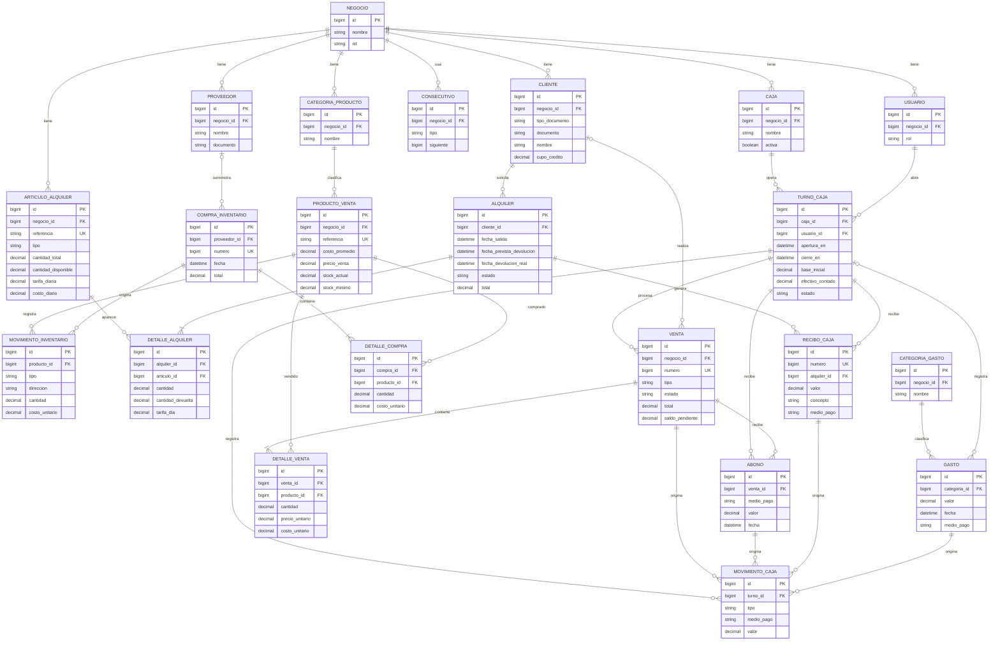

```mermaid
erDiagram
    NEGOCIO ||--o{ USUARIO : tiene
    NEGOCIO ||--o{ CLIENTE : tiene
    NEGOCIO ||--o{ PROVEEDOR : tiene
    NEGOCIO ||--o{ CONSECUTIVO : usa
    NEGOCIO ||--o{ CATEGORIA_PRODUCTO : tiene
    CATEGORIA_PRODUCTO ||--o{ PRODUCTO_VENTA : clasifica
    PRODUCTO_VENTA ||--o{ MOVIMIENTO_INVENTARIO : registra

    NEGOCIO ||--o{ ARTICULO_ALQUILER : tiene
    ARTICULO_ALQUILER ||--o{ DETALLE_ALQUILER : aparece
    CLIENTE ||--o{ ALQUILER : solicita
    ALQUILER ||--|{ DETALLE_ALQUILER : contiene
    ALQUILER ||--o{ RECIBO_CAJA : genera

    NEGOCIO ||--o{ CAJA : tiene
    CAJA ||--o{ TURNO_CAJA : opera
    USUARIO ||--o{ TURNO_CAJA : abre
    TURNO_CAJA ||--o{ MOVIMIENTO_CAJA : registra
    TURNO_CAJA ||--o{ ABONO : recibe
    TURNO_CAJA ||--o{ RECIBO_CAJA : recibe
    TURNO_CAJA ||--o{ VENTA : procesa

    CLIENTE o|--o{ VENTA : realiza
    VENTA ||--|{ DETALLE_VENTA : contiene
    PRODUCTO_VENTA ||--o{ DETALLE_VENTA : vendido
    VENTA ||--o{ ABONO : recibe
    VENTA ||--o{ MOVIMIENTO_CAJA : origina
    ABONO ||--o{ MOVIMIENTO_CAJA : origina
    RECIBO_CAJA ||--o{ MOVIMIENTO_CAJA : origina

    PROVEEDOR o|--o{ COMPRA_INVENTARIO : suministra
    COMPRA_INVENTARIO ||--|{ DETALLE_COMPRA : contiene
    PRODUCTO_VENTA ||--o{ DETALLE_COMPRA : comprado
    COMPRA_INVENTARIO ||--o{ MOVIMIENTO_INVENTARIO : origina

    CATEGORIA_GASTO ||--o{ GASTO : clasifica
    TURNO_CAJA o|--o{ GASTO : registra
    GASTO ||--o{ MOVIMIENTO_CAJA : origina

    NEGOCIO {
      bigint id PK
      string nombre
      string nit
    }
    USUARIO {
      bigint id PK
      bigint negocio_id FK
      string rol
    }
    CLIENTE {
      bigint id PK
      bigint negocio_id FK
      string tipo_documento
      string documento
      string nombre
      decimal cupo_credito
    }
    PRODUCTO_VENTA {
      bigint id PK
      bigint negocio_id FK
      string referencia UK
      decimal costo_promedio
      decimal precio_venta
      decimal stock_actual
      decimal stock_minimo
    }
    MOVIMIENTO_INVENTARIO {
      bigint id PK
      bigint producto_id FK
      string tipo
      string direccion
      decimal cantidad
      decimal costo_unitario
    }
    ARTICULO_ALQUILER {
      bigint id PK
      bigint negocio_id FK
      string referencia UK
      string tipo
      decimal cantidad_total
      decimal cantidad_disponible
      decimal tarifa_diaria
      decimal costo_diario
    }
    ALQUILER {
      bigint id PK
      bigint cliente_id FK
      datetime fecha_salida
      datetime fecha_prevista_devolucion
      datetime fecha_devolucion_real
      string estado
      decimal total
    }
    DETALLE_ALQUILER {
      bigint id PK
      bigint alquiler_id FK
      bigint articulo_id FK
      decimal cantidad
      decimal cantidad_devuelta
      decimal tarifa_dia
    }
    VENTA {
      bigint id PK
      bigint negocio_id FK
      bigint numero UK
      string tipo
      string estado
      decimal total
      decimal saldo_pendiente
    }
    DETALLE_VENTA {
      bigint id PK
      bigint venta_id FK
      bigint producto_id FK
      decimal cantidad
      decimal precio_unitario
      decimal costo_unitario
    }
    ABONO {
      bigint id PK
      bigint venta_id FK
      string medio_pago
      decimal valor
      datetime fecha
    }
    CAJA {
      bigint id PK
      bigint negocio_id FK
      string nombre
      boolean activa
    }
    TURNO_CAJA {
      bigint id PK
      bigint caja_id FK
      bigint usuario_id FK
      datetime apertura_en
      datetime cierre_en
      decimal base_inicial
      decimal efectivo_contado
      string estado
    }
    MOVIMIENTO_CAJA {
      bigint id PK
      bigint turno_id FK
      string tipo
      string medio_pago
      decimal valor
    }
    RECIBO_CAJA {
      bigint id PK
      bigint numero UK
      bigint alquiler_id FK
      decimal valor
      string concepto
      string medio_pago
    }
    COMPRA_INVENTARIO {
      bigint id PK
      bigint proveedor_id FK
      bigint numero UK
      datetime fecha
      decimal total
    }
    DETALLE_COMPRA {
      bigint id PK
      bigint compra_id FK
      bigint producto_id FK
      decimal cantidad
      decimal costo_unitario
    }
    CATEGORIA_GASTO {
      bigint id PK
      bigint negocio_id FK
      string nombre
    }
    GASTO {
      bigint id PK
      bigint categoria_id FK
      decimal valor
      datetime fecha
      string medio_pago
    }
    CONSECUTIVO {
      bigint id PK
      bigint negocio_id FK
      string tipo
      bigint siguiente
    }
    CATEGORIA_PRODUCTO {
      bigint id PK
      bigint negocio_id FK
      string nombre
    }
    PROVEEDOR {
      bigint id PK
      bigint negocio_id FK
      string nombre
      string documento
    }
```
